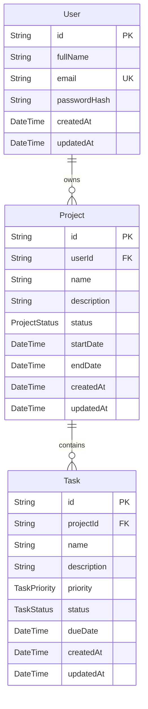

# Entity–Relationship Diagram

PostgreSQL via Prisma ORM. IDs are cuid strings; all keys are primary/foreign keys as shown.



## Cardinalities

| Relationship | From | To | Card | Cascade |
|--------------|------|----|------|---------|
| Owns | User | Project | 1 → many | `ON DELETE CASCADE` (user delete removes projects) |
| Contains | Project | Task | 1 → many | `ON DELETE CASCADE` (project delete removes tasks) |

Tasks cannot exist without a valid project: `projectId` is a required foreign key (`Task.projectId → Project.id`), and `Project.userId → User.id` anchors every task to a user through its project. Deleting a project deletes its tasks.

## User

| Column | Type | Constraints |
|--------|------|-------------|
| id | `String` (cuid) | Primary key, `@default(cuid())` |
| fullName | `String` | required |
| email | `String` | required, **UNIQUE**, indexed |
| passwordHash | `String` | required (bcrypt, cost 12; never returned by the API) |
| createdAt | `DateTime` | `@default(now())` |
| updatedAt | `DateTime` | `@updatedAt` |

## Project

| Column | Type | Constraints |
|--------|------|-------------|
| id | `String` (cuid) | Primary key, `@default(cuid())` |
| userId | `String` | **FK → User.id**, required, `ON DELETE CASCADE`, indexed |
| name | `String` | required (≤120 chars, validated) |
| description | `String?` | nullable (≤2000 chars, validated) |
| status | `enum ProjectStatus` | `NOT_STARTED \| IN_PROGRESS \| COMPLETED`, default `NOT_STARTED`, indexed |
| startDate | `DateTime?` | nullable |
| endDate | `DateTime?` | nullable (validated ≥ startDate) |
| createdAt | `DateTime` | `@default(now())` |
| updatedAt | `DateTime` | `@updatedAt` |

Composite index: `(userId, status)` — supports filter-by-status queries for a single user.

## Task

| Column | Type | Constraints |
|--------|------|-------------|
| id | `String` (cuid) | Primary key, `@default(cuid())` |
| projectId | `String` | **FK → Project.id**, required, `ON DELETE CASCADE`, indexed |
| name | `String` | required (≤120 chars, validated) |
| description | `String?` | nullable (≤2000 chars, validated) |
| priority | `enum TaskPriority` | `LOW \| MEDIUM \| HIGH`, default `MEDIUM`, indexed |
| status | `enum TaskStatus` | `PENDING \| IN_PROGRESS \| COMPLETED`, default `PENDING`, indexed |
| dueDate | `DateTime?` | nullable |
| createdAt | `DateTime` | `@default(now())` |
| updatedAt | `DateTime` | `@updatedAt` |

## Enums

```sql
ProjectStatus  : NOT_STARTED | IN_PROGRESS | COMPLETED
TaskStatus     : PENDING     | IN_PROGRESS | COMPLETED
TaskPriority   : LOW         | MEDIUM      | HIGH
```

## Indexes (summary)

| Table | Columns | Notes |
|-------|---------|-------|
| User | `email` | unique |
| Project | `userId` | FK lookup |
| Project | `status` | |
| Project | `userId, status` | composite |
| Task | `projectId` | FK lookup |
| Task | `status` | |
| Task | `priority` | |

All user-facing queries are owner-scoped via these indexes (`Project.userId`, `Task.projectId → Project.userId`), and user-provided input is passed through typed Prisma queries — never interpolated raw SQL.